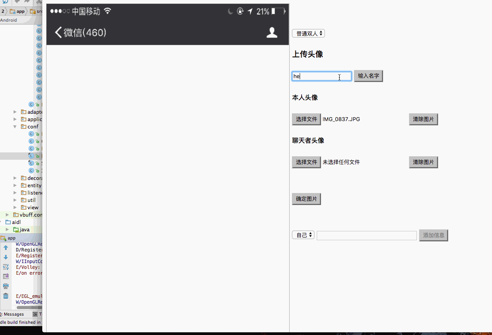

# 微信聊天图片生成

## 效果展示

gif下可能对方的聊天对话框看不清世界效果请移步
[demo](https://sunshine168.github.io/createWechatRecord/dist/html/)
## 简介 
   这是一个可以自定义备注,自己上传双方头像，生成聊天图片的。
   刚接触canvas,在教程中看到比较有趣的地方,于是乎就动手撸一下了。
  因为是分块的,所以其实状态栏和对话栏都可以手动替换,所以可以用到其他对话生成里面,只要符合这种四层结构的都可以生成。 
 (手机状态栏,对话者栏,聊天栏,输入栏)
 后面更新个图会清晰点。。 
  
   
## 使用方法

 选择模式
   可添加名字
    ———> 双人需要上传两张头像
    ———> 独白需要上传自己头像
    ———> 对方独白需要上传对方头像
    
 点击确定图片后即可添加信息(web应用支持emoji)
 
## 待完成
* [ ] *信息中头像大小和信息位置的配置*
* [x] *字体大小的问题 在中文字上面比较严重 后面留白比较多 ！*
* [x] gulp加入babel转化为es5
* [ ] 替换自定义背景的api已经有了。。迟点加上去
界面有点丑。。 迟点更新一下
* [x] 下载功能
* [x] 代码整理
 
## 修改方式

1.直接在dist目录里修改
2.（。。这个gulp配置是简单入门typescript的时候配置的,建议用自己的其实）

```
gulp test //编译命令 
```


## 笔记

```
context.measureText(text).width//计算text的宽度
```


